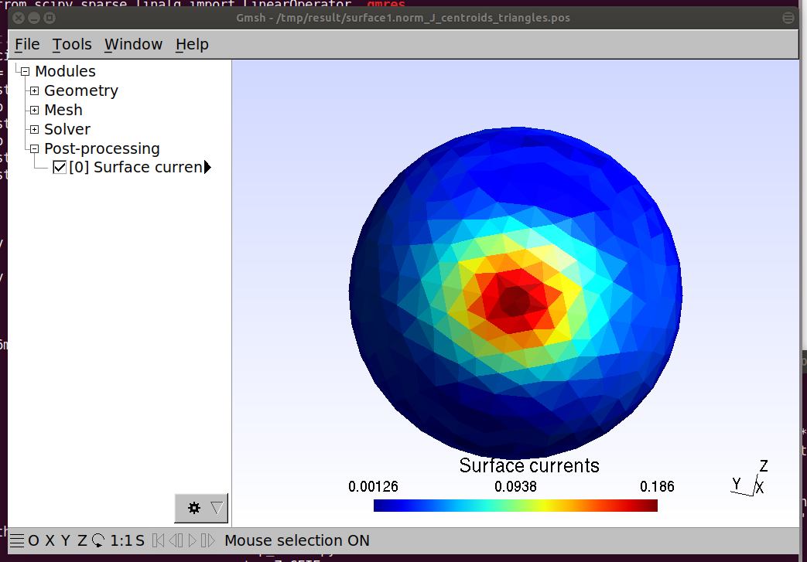
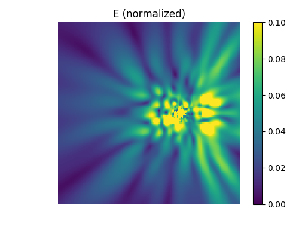

# Setting up a Python development environment

```
wget https://repo.anaconda.com/archive/Anaconda3-2019.03-Linux-x86_64.sh
sh Anaconda3-2019.03-Linux-x86_64.sh
bash
conda create -n py36 python=3.6 anaconda
```

# Cloning this repository

```
git clone http://192.168.11.46:8081/snowball/reconst_meas_test.git
```

# Building libraries

```
cd reconst_meas_test
./build.sh
```

# Running a simulation
```
source activate py36
```
```
python read_MLFMA_mesh_part1.py
python mesh_functions_seb.py
python setup_MLFMA_mesh.py
python read_MLFMA_mesh_part2.py
python setup_MLFMA_poles.py
python makeFFmat.py
```
```
OMP_NUM_THREADS=4 python solveFFmat.py
```

Open .pos files in result/ with `gmsh`. You will see the surface current distribution as shown:



The near-field distributions can be computed and drawn by running the following command:

```
python computeEobs.py
```

Check image files in result/.



# Where is the configuration file?

See:
* [inputParams/simulation_parameters.py](inputParams/simulation_parameters.py)

# Organization of the code
The core functions of this simulator are written in C++.
These files are located in [c++](c++).
Some of the files are taken from the open source project `Puma-EM`.
In order to call functions written in C++ from a python script, the following scripts are provided.
* [setup_E_FF.py](setup_E_FF.py) [setup_poynting.py](setup_poynting.py) [setup_Z_CFIE.py](setup_Z_CFIE.py) [setup_nbin.py](setup_nbin.py) [setup_trans.py](setup_trans.py) [setup_Z_obs.py](setup_Z_obs.py)

These files are executed in build.sh.
You don't need to run these scripts manually.
Once you have executed [build.sh](build.sh), you can use C++ functions like the following in [makeFFmat.py](makeFFmat.py).

```python
from E_FF import Pywrap_compute_FFmat
```

# Credit
This program is written by S. Omi.
This document (README.md) is written by Y. Kushiyama.